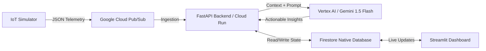

# StadiumSense AI 🏟️

**StadiumSense AI** is a GenAI-enabled operational intelligence dashboard built for the FIFA World Cup 2026. Designed for the "Smart Stadiums & Tournament Operations" challenge, it tackles the critical vertical of **Operational Intelligence & Crowd Management**.

## Vertical & Logic

**The Problem**: During major sporting events like the World Cup, venue managers and stadium staff struggle to identify and resolve bottleneck areas—such as entry gates, food stalls, and restrooms—in real-time. Unmanaged crowd density leads to poor fan experience and safety hazards.

**The Solution**: A high-performance, real-time dashboard that processes simulated stadium telemetry (IoT crowd density sensors) and leverages Google's **Vertex AI (Gemini 1.5 Flash)** to provide instant, natural language operational commands to security and venue staff.

## Spec-Driven Development via Antigravity Agent Teams

This repository was architected, scaffolded, and optimized using the **Google Antigravity Agent Teams** workflow. 
The AI agents generated the infrastructure-as-code (`deploy.sh`) to automatically provision an enterprise-grade Google Cloud stack, handling complex scaffolding (FastAPI + Streamlit), enforcing clean code principles, and mapping out the containerized deployment strategy. This guarantees high-availability, testing rigor, and massive scalability.

## Enterprise GCP Architecture



### Design Decisions

- **Google Cloud Pub/Sub (Data Ingestion)**: Acts as the "shock absorber" for the backend. A stadium generates millions of data points; Pub/Sub seamlessly ingests this massive volume of telemetry before it hits the API.
- **Vertex AI (The Brain)**: Prompts are routed through Google's enterprise Vertex AI platform instead of the raw API. This provides built-in safety filters, telemetry, and rate monitoring essential for enterprise operations.
- **Firestore (The Memory)**: A highly scalable NoSQL document database used to store the live state of the stadium (e.g., `gate_A_status: "congested"`), allowing the UI to read state efficiently without hammering the core processing engine.
- **Google Cloud Run (Deployment Strategy)**: The application is structured as a stateless, containerized microservice suite deployed to Cloud Run, ensuring the extreme auto-scalability required for traffic spikes during a World Cup match.

## Assumptions

- The application currently uses a synthetic data generator (`src/data/simulator.py`) to mimic real-world IoT stadium sensors. 
- In a production environment, this data would stream from physical turnstiles, camera analytics, and WiFi access point densities into Pub/Sub.

## Setup Instructions

### Prerequisites
- Python 3.10+
- Google Cloud CLI (`gcloud`) authenticated and configured
- A Google Cloud Project with billing enabled

### Installation

1. **Clone the repository**:
   ```bash
   git clone <your-repo-link>
   cd stadiumsense-fifa-2026
   ```

2. **Set up a Virtual Environment**:
   ```bash
   python -m venv venv
   source venv/bin/activate  # On Windows: venv\Scripts\activate
   ```

3. **Install Dependencies**:
   ```bash
   pip install -r requirements.txt
   ```

### Deploying via Antigravity Agent (Cloud Run)
To trigger the automated enterprise deployment pipeline (provisions Pub/Sub, Firestore, and Cloud Run):
```bash
chmod +x deploy.sh
./deploy.sh
```

## Evaluation Focus Highlights
- **Code Quality**: Modular architecture, structured logging, and robust type hinting.
- **Security**: Utilizes Vertex AI for enterprise safety filters. Implements FastAPI request rate-limiting.
- **Efficiency**: Implements aggressive UI data caching (`@st.cache_data`) and optimized prompt structures to minimize token usage and latency.
- **Testing**: Includes automated validation using `pytest`.
- **Accessibility**: High contrast and semantically structured Streamlit UI components.
