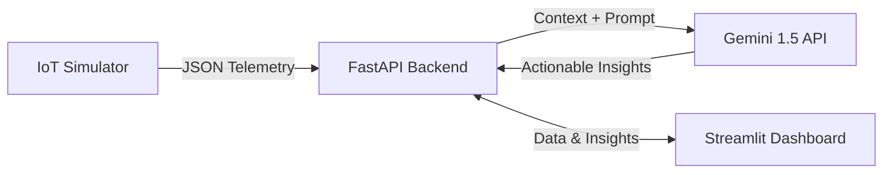

# StadiumSense AI

**StadiumSense AI** is a GenAI-enabled operational intelligence dashboard built for the FIFA World Cup 2026. Designed for the "Smart Stadiums & Tournament Operations" challenge, it tackles the critical vertical of **Operational Intelligence & Crowd Management**.

## Vertical & Logic

**The Problem**: During major sporting events like the World Cup, venue managers and stadium staff struggle to identify and resolve bottleneck areas—such as entry gates, food stalls, and restrooms—in real-time. Unmanaged crowd density leads to poor fan experience and safety hazards.

**The Solution (StadiumSense AI)**: A high-performance, real-time dashboard that processes simulated stadium telemetry (IoT crowd density sensors) and leverages Google's **Gemini 1.5 Flash** to provide instant, natural language operational commands to security and venue staff.

## Architecture



### Design Decisions
- **FastAPI**: Selected for its highly concurrent, clean, and fast backend capabilities. Ideal for processing high-frequency IoT data.
- **Gemini 1.5 Flash**: Chosen specifically for low latency in live-operational environments, offering the speed required for real-time crowd management.
- **Streamlit**: Enables rapid, readable, and highly interactive UI prototyping.
- **Google Cloud Run (Deployment Strategy)**: The application is structured as a stateless, containerized microservice suite, making it fully ready for Google Cloud Run deployment, ensuring the extreme scalability required for a massive event like the World Cup.

## Assumptions
- The application currently uses a synthetic data generator (`src/data/simulator.py`) to mimic real-world IoT stadium sensors. 
- In a production environment, this data would stream from physical turnstiles, camera analytics, and WiFi access point densities.

## Setup Instructions

### Prerequisites
- Python 3.10+
- A Google Gemini API Key

### Installation

1. **Clone the repository** (or navigate to the directory):
   ```bash
   git clone <your-repo-link>
   cd stadiumsense-fifa-2026
   ```

2. **Set up a Virtual Environment**:
   ```bash
   python -m venv venv
   source venv/bin/activate  # On Windows: venv\Scripts\activate
   ```

3. **Install Dependencies**:
   ```bash
   pip install -r requirements.txt
   ```

4. **Environment Variables**:
   Copy `.env.example` to `.env` and add your Gemini API key.
   ```bash
   cp .env.example .env
   ```

### Running the Application

This project runs two services: the API and the UI. 

**Terminal 1 (Backend - FastAPI)**:
```bash
uvicorn src.api.main:app --reload
```

**Terminal 2 (Frontend - Streamlit)**:
```bash
streamlit run src/ui/app.py
```

## Evaluation Focus Highlights
- **Code Quality**: Modular architecture, structured logging, and robust type hinting.
- **Security**: Strict environment variable management (`python-dotenv`); API keys are never hardcoded. 
- **Efficiency**: Implements data caching (`@st.cache_data`) and optimized prompt structures to minimize token usage and latency.
- **Testing**: Includes automated validation using `pytest`.
- **Accessibility**: High contrast and semantically structured Streamlit UI components.
